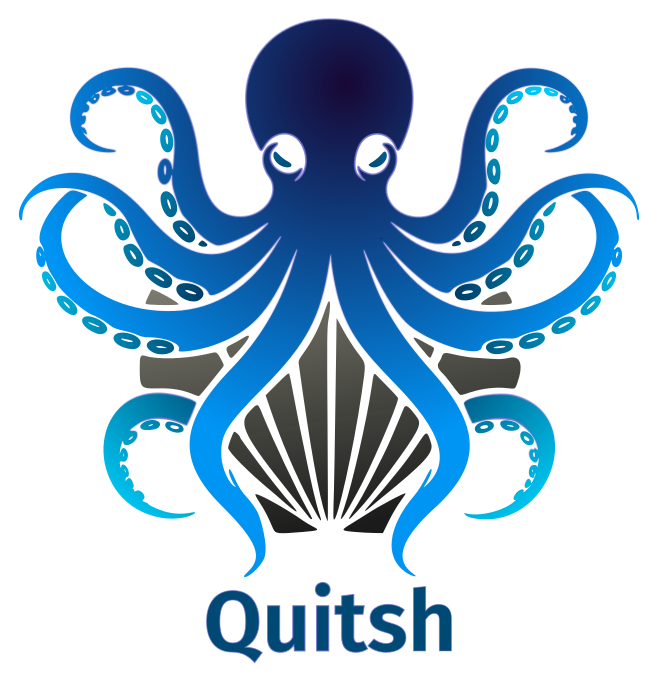

<p align="center">
    
</p>

<p align="center">
  <a href="https://codecov.io/gh/sdsc-ordes/quitsh">
    
  </a>
  <a href="https://github.com/sdsc-ordes/quitsh/releases/latest">
    
  </a>
  <a href="https://github.com/sdsc-ordes/quitsh/actions/workflows/normal.yaml">
    
  </a>
  <a href="https://mit-license.org/">
    
  </a>
</p>

---

> [!CAUTION]
>
> This repository is in `beta`. The design space of this tool is still explored
> and breaking changes might occure. Documentation is incomplete.

The `quitsh` framework (`/kwɪʧ/`) is a build-tooling **CLI framework** designed
to replace loosely-typed scripting languages (e.g., `bash`, `python`, and
similar alternatives) with the statically-typed language `Go`. Its goal is to
simplify tooling tasks while providing robust, extendable solutions for
component repositories (mono-repositories).

`quitsh` is an opinionated framework born out of frustration with the lack of
simple and extendable tooling for mono-repos. It is language-agnostic and
toolchain-independent, allowing users to focus on their workflows without being
constrained by specific technologies.

Quitsh can be used in two non-coupled ways (enhancing each other):

- Build/use & extend the CLI `quitsh` for your tooling/CI/CD scripts in your
  repository. You write `quitsh mycommand --do-it` and decide what it does,
  using the [library modules](#built-in-libraries) for running subprocesses,
  logging etc.

- Use its [component feature](#component-system) which gives you the ability to
  register your tooling scripts (build/lint/test etc.) as
  [runners](#runner-system) which can be reused across
  [components](#components). Since runners depend heavily on available
  executables in your `PATH`, runners run over a toolchain (currently Nix
  development shell etc.).

## Key Features

### Code-First Approach

- All tooling logic is implemented in `Go`.
- Tooling logic is defined primarily in code, avoiding declarative
  configurations or templated non-typed languages, which often add unnecessary
  complexity despite their flexibility. _Note: Supporting configuration
  languages like `jsonnet` or "turing-complete" YAML etc. is particularly
  avoided. **Everything stays strongly-typed and fast compiled.**_

### Extendability

- `quitsh` serves as a library to build **your customized** CLI tool for your
  specific tasks.
- Users can add custom commands and specialized tooling features using libraries
  like [`cobra`](https://github.com/spf13/cobra), `quitsh mycommand --do-it`.

### Component System

- [Components](#components) (i.e., buildable units) are identified by placing a
  configuration file (default: `.component.yaml`) in the corresponding
  subdirectory.

#### Targets and Steps

- Each component defines **targets**, which consist of multiple **steps**.
- Targets can depend on other targets across the repository.
- Input change sets can be specified for each target to track modifications and
  determine if the target is outdated.

#### Runner System

- Steps within targets are executed by **runners**, which are written by you in
  Go and act as reusable replacements for traditional build/tooling scripts.
- Runners can have custom YAML configuration options specified per component in
  `.component.yaml`.

#### Toolchain Dispatch

- Runners are associated with specific toolchains.
- By default, `quitsh` includes a
  [Nix development shell dispatch](https://nix.dev/tutorials/first-steps/declarative-shell.html),
  providing stable and reproducible environments.
- While container-based dispatching is not a primary goal, it can be implemented
  by extending the dispatch interface.

- The tool was built to replicate the same procedure one executes during local
  development and also in CI. Having CI align with what you execute locally is
  not a nice thing to have, its a necessity. Nix development shells (or
  containers) help with this. A Nix shell provides a simple and robust
  abstraction to pin a toolchain. The following visualization gives an overview
  about how `quitsh` is used:

  <p align="center">

  

  </p>

### Built-in Libraries

The `pkg` folder offers utilities for common development needs, such as:

- Command Execution: [`pkg/exec`](pkg/exec) provides utilities for process
  execution and command chaining.
- Structured Logging: [`pkg/log`](pkg/log) enables consistent and readable
  logging.
- Error Handling: [`pkg/error`](pkg/error) facilitates contextual error
  management.
- Dependency Graphs: Tools for managing and resolving dependency graphs across
  targets.
- Some Go `test` runners (here as an example) for running Go tests (its used
  internally to test `quitsh` it-self).

#### Performance

- Since all tooling is written in `Go`, `quitsh` provides type safety and fast
  performance by default.
- Combined with a Nix-based toolchain dispatch and the ability to write tests
  easily, the framework significantly accelerates the "change, test, improve"
  workflow.

#### Nix Integration

- A CLI tool built with `quitsh` can be
  [seamlessly packaged](./tools/nix/packages/cli) into a Nix development shells,
  ensuring accessibility for all users of a given repository.

---

# How To Use It?

Using this library follows instantiating the CLI (also demonstrated in this
repository in [`main.go`](./tools/cli/cmd/cli/main.go), e.g.:

```go
args := cliconfig.New()

cli, err := cli.New(
  &args.Commands.Root,
  &args,
  cli.WithName("cli"),
  cli.WithDescription("This is the 🐔-🥚 CLI tool for 'quitsh', yes its built with 'quitsh'."),
  cli.WithCompFindOptions(
    query.WithFindOptions(
      fs.WithWalkDirFilterPatterns(nil,
        []string{"**/test/repo/**"}, true))),
  cli.WithStages("lint", "build", "test"),
  cli.WithTargetToStageMapperDefault(),
  cli.WithToolchainDispatcherNix(
    "tools/nix",
    func(c config.IConfig) *toolchain.DispatchArgs {
      cc := common.Cast[*cliconfig.Config](c)

      return &cc.Commands.DispatchArgs
    },
  ),
)
```

You can now add runners and your own commands depending on the needs of your
repository. For example in [`main.go`](./tools/cli/cmd/cli/main.go):

```go
listcmd.AddCmd(cli, cli.RootCmd())
configcmd.AddCmd(cli.RootCmd(), &conf)
exectarget.AddCmd(cli, cli.RootCmd())
execrunner.AddCmd(cli, cli.RootCmd(), &conf.Commands.DispatchArgs)
```

adds essential `quitsh` commands

- `listcmd` to list all components etc: `quitsh list`.
- `configcmd` to inspect/write the config file: `quitsh config ...`.
- `exectarget` to execute specific targets `quitsh exec-target`.
- `execrunner` to let `quitsh` dispatch over toolchains (see
  `cli.WithToolchainDispatcherNix` above): `quitsh exec-runner ...`

There are lots of more useful commands in [`pkg/cli/cmd`](./pkg/cli/cmd) which
you might use.

## Useful References

A reference repository with commands and runner can be looked at here:

- [`Custodian`](https://gitlab.com/data-custodian/custodian/tree/main/tools/quitsh)
- [`DAC-Portal`](https://gitlab.com/data-custodian/dac-portal/tree/main/tools/quitsh)
- [`Quitsh (this repo)`](https://github.com/sdsc-ordes/quitsh)

## Config

Quitsh runs with global config YAML file which it loads (or defaults) at startup
for any invocation. The above CLI instantiation constructs a new config with
`cliconfig.New()` (this is custom for each usecase and can be adjusted and
modified). The config defines global settings (output directories, logging etc.)
and also various custom, use-case specific settings. These might include
settings which runners (or custom commands) might use during execution. For
example build runners might use a
[`build.BuildType`](./tools/cli/pkg/config/config.go) property which could be
`debug` or `release` etc. The CLI does not care about your custom settings, they
only need to be fully serializable to YAML (for toolchain dispatching) and you
can override defaults from custom added commands for example.

### Modifying Config Values

You have the ability to set the config file `quitsh` uses with `--config` or
read it from stdin with `--config -` or set options (YAML) on the command line
with `--config-value`. For example `--config-value "build.buildType: release"`
would set the `build.BuildType` setting to `release` on startup.

## Components

Quitsh builds around **components**. A **component** should be treated as an own
compartment/Git repository or directory with its own independent source code and
output.

A component in `quitsh` is defined by a `.component.yaml` (name is
configurable):

```yaml
# The name of the component: Must be a unique.
name: my-component

# A semantic version.
# This is useful for Nix packaging etc.
version: 0.2.1

# A simple annotation (not used internally) what main language this component uses.
language: go

targets:
  # A target called `test` with two steps.
  my-test:
    # The stage to which this target belongs. Does not need to be provided
    # if the CLI is setup to map target names to stages.
    stage: test

    steps:
      # Step 1: Using runner with ID (how it was registered).
      - runner-id: banana-project::my-test-runner
        config: # Your custom runner YAML config, (optional).

      # Step 2: Using a runner with registered key (stage: `test`, name `my-test`)
      - runner: my-test

  # A target called `build-all` with one step.
  build-all:
    stage: build

    # Defining when this target is considered changed:
    # i.e. whenever `self::sources` input change set is changed.
    # `self` maps to this component.
    inputs: ["self::sources"]

    # Defining dependencies on other targets such that this
    # target is executed after target `my-test` above.
    # You can also link to other components (e.g `other-comp::build`).
    depends: ["self::my-test"]

    steps:
      # Step 1: Using a runner with registered key (stage: `build`, name `my-test`)
      - runner: my-build
        config:
          tags: ["doit"]

  lint:
    steps:
      - ... other steps ...

inputs:
  # An input change set with name `sources` which defines
  # patterns to match all source files.
  sources:
    # A regex which matches `*.go` files in `./src` in the components folder.
    patterns:
      - '^./src/.*\.go$'
```

## Execution of Targets

The execution of steps by `quitsh` is done by reading a
[`.component.yaml`](.component.yaml) for each component. The
[`.component.yaml`](.component.yaml) file contains _inputs_ and _targets_.

Quitsh's own [`.component.yaml`](./.component.yaml) looks like:

```yaml
name: quitsh
language: go

inputs:
  srcs:
    patterns:
      - "^.*$"

targets:
  test:
    stage: test
    steps:
      - runner: go
      - runner: go-bin
        config:
          # Build everything instrumented.
          # Execute the binaries via a `go test` provided in the following
          # pkg and with tags.
          buildPkg: test/cmd
          testPkg: test
          buildTags: ["integration"]
          testTags: ["integration"]

  build:
    steps:
      - runner: go
  lint:
    steps:
      - runner: go
```

Each **target** defines is a set of **steps** which itself are further specified
by the field `runner`. A **runner** is **Go code** applicable for a certain step
which should work for all components.

A runner is registered in [`factory`](./pkg/runner/factory/runner.go), for
example [here](./tools/cli/pkg/runner/go/lint.go). Runners can be written by
implementing the interface [`Runner`](./pkg/runner/runner.go) inside
[`./pkg/runner/runners`](./pkg/runner/runners) and registering them in
[`./pkg/runner/factory/init-runners.go`], for example
[here](./tools/cli/pkg/runner/go/register.go).

> [!NOTE]
>
> **You can execute targets in parallel with `--parallel`**.

## Runner Configuration

Runners can load independent YAML config under `config` to make them
configurable, e.g. the `go` build runner loads the following
[config](./pkg/runner/runners/go/build-config.go):

```yaml
steps:
  build:
    - runner: go
      config:
        version-module: "pkg/myversion-module" # defaults to `pkg/build`
```

## Target Stages

Each target also maps to a _stage_ which `quitsh` uses to group targets together
if you want to find them and make gathering commands such as the example
[`build` here](https://gitlab.com/data-custodian/custodian/-/blob/main/tools/quitsh/cmd/quitsh/cmd/build/build.go#L83).
It collects and runs all targets in the stage `build`.

## How to Extend Functionality

For users using the `quitsh` CLI framework, it is suggested to follow the
following points when thinking about new functionality in a repository which
uses this library. If you need new functionality for CI and local development
which you normally would write in `bash`/`python` follow the following steps:

- If the functionality is **a feature needed in an existing runner and step**:
  Extend the runner and make it work with your new test/build/lint feature.

- If the functionality is **not related to a runner or the same for each
  component with that language**: Extend `quitsh` by providing another
  subcommand which does what you need, see this example
  [`fix-hash`](https://gitlab.com/data-custodian/custodian/-/blob/main/tools/quitsh/cmd/quitsh/cmd/nix/fix-hash/fix.go).

- If the functionality is **for a certain language, e.g. `go` or `python` and
  applies to each component which is written in that language**: consider adding
  a new runner for an already pre-defined stage, e.g. `lint`, `build` etc.

## Example Applications

Understand what this framework does, is best accomplished by understanding how
we use this framework in our
[components repo (mono-repo)](https://gitlab.com/data-custodian/custodian). Our
major components are located in
[./components](https://gitlab.com/data-custodian/custodian/-/tree/main/components).
